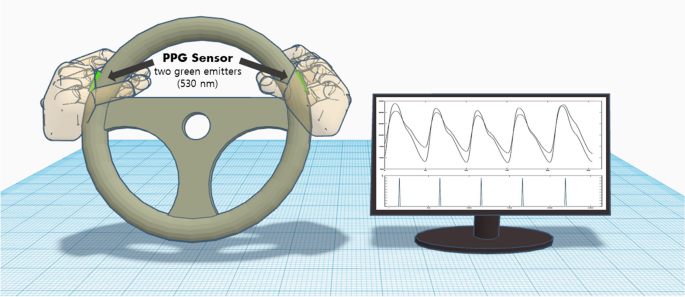

# Vital signs: PPG Signal Analysis

Using only the driver's hands, **Vital signs such as heart rate can be monitored to confirm whether he is in good condition or not to avoid accidents.
And make a decision such as stopping the vechile.**
    

 
 

## Why use PPG over ECG?
PPG indirectly measures heart rate and can be measured anywhere with adequate access to skin vessels. 
Although not as accurate as ECG, it is worth noting that PPG is still an incredibly accurate measure of heart rate

 
 

## Algorithm
**Description :**  Systolic upslopes are detected from a signal generated with a slope sum function, which sums the magnitudes of the PPG upslopes in the previous 0.17 s. Adaptive thresholding is used to identify systolic upslopes in this signal. The 'qppgfast' implementation of this beat detector was used, after testing showed it performed similarly to the original 'qppg' implementation.

**inputs**

	    sig : a vector of PPG values

	    fs : the sampling frequency of the PPG in Hz

**outputs**

	    peaks : indices of detected pulse peaks

	    onsets : indices of detected pulse onsets
 
 

## My Contribuation
My contribution was about implementation the algorithm in Python programming language.

 
 

## References

A. N. Vest et al., 'An open source benchmarked toolbox for cardiovascular waveform and interval analysis,' Physiological Measurement, vol. 39, no. 10, 2018. [https://doi.org/10.1088/1361-6579/aae021](https://doi.org/10.1088/1361-6579/aae021)

